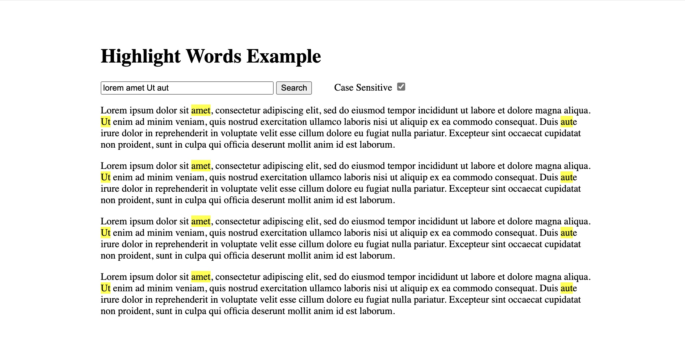

<!-- Generated by documentation.js. Update this documentation by updating the source code. -->

# Highlight words in HTML



<!--ts-->

- [Highlight words in HTML](#highlight-words-in-html)
  - [Description](#description)
  - [Example](#example)
  - [API](#api) _
  [function markText(rootNode: HTMLElement, word: string, caseSensitive = false)](#function-marktextrootnode-htmlelement-word-string-casesensitive--false)
  _ [Parameters](#parameters) _
  [function unMarkText(rootNode: HTMLElement)](#function-unmarktextrootnode-htmlelement)
  _ [Parameters](#parameters-1)
  <!--te-->

## Description

Using the `highlightWords` typescript library you can easily add highlighting of
words in HTML. For example when searching for a word you can use this library to
highlight the searched word in the webpage. Highlighting is implemented by wrapping
the word between `<mark>..</mark>` tags. The [mark][7] tag is supported in HTML5.

Using the `markText` function you can add highlighting for all appearances of word in
child text nodes of a given root node. You can repeat this to add highlighting for
several different words.

Using the `unMarkText` function you can remove all highlighting in in child text
nodes of a given root node.

## Example

The example shown above in the image can be viewed live
[here](https://raw.githack.com/harcokuppens/highlight-words/226f6be667c0332bbb266f172416cd904da17528/example/index.html).

The code of the example can be viewed
[here](https://github.com/harcokuppens/highlight-words/tree/main/example).

In this code we fetch the text in the input box, split it into words, undo previous
highlighting with `unMarkText` and highlight each word with `markText`:

```javascript
import { markText, unMarkText } from "./highlightWords.js";

const input = document.getElementById("wordInput").value;
const words = input.split(" ");
unMarkText(document.body);
words.forEach((word) => {
  markText(document.body, word, window.caseSensitive);
});
```

## API

### function markText(rootNode: HTMLElement, word: string, caseSensitive = false)

Highlight given word in child text nodes of a given root node. Highlighting is
implemented by wrapping the word between `<mark>..</mark>` tags. By default words
match case insensitive, but you can enable case sensitivity. The [mark][7] tag is
supported in HTML5.

#### Parameters

- `rootNode` **[HTMLElement][5]**
- `word` **[string][6]**
- `caseSensitive` **[boolean][8]**&#x20;

### function unMarkText(rootNode: HTMLElement)

Remove all highlighting in child text nodes of a given root node. Remove highlighting
is implemented by unwrapping words between `<mark>..</mark>` tags. The [mark][7] tag
is supported in HTML5.

#### Parameters

- `rootNode` **[HTMLElement][5]**&#x20;

[1]: #marktext
[2]: #parameters
[3]: #unmarktext
[4]: #parameters-1
[5]: https://developer.mozilla.org/docs/Web/HTML/Element
[6]:
  https://developer.mozilla.org/docs/Web/JavaScript/Reference/Global_Objects/String
[7]: https://developer.mozilla.org/docs/Web/HTML/Element/mark
[8]:
  https://developer.mozilla.org/en-US/docs/Web/JavaScript/Reference/Global_Objects/Boolean

```

```
